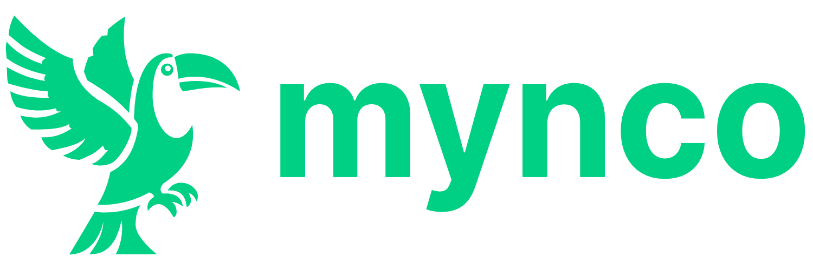

# 🚀 Mynco - Professional Client Portals for Freelancers

<div align="center">



**Turn any client into a premium experience**

*Stop sending Google Drive links. Create professional client portals that get you paid faster.*

[](https://mynco.app)
[](LICENSE)
[]()

</div>

---

## 🎯 **What is Mynco?**

Mynco is the **simplest client onboarding tool** for freelancers and agencies. Create stunning, professional client portals in 30 seconds, impress your clients, and get paid automatically.

### ✨ **The Problem We Solve**
- ❌ Sending amateur Google Drive links
- ❌ Chasing payments via PayPal requests  
- ❌ Messy email chains for project communication
- ❌ Looking unprofessional compared to agencies

### ✅ **The Mynco Solution**
- 🎨 **Beautiful branded client portals** - Look like Apple, not amateur
- 💰 **Pay-to-download system** - Client approves, pays, downloads automatically
- 💬 **Built-in communication** - Keep everything organized in one place
- 📊 **Professional analytics** - Track engagement and optimize delivery

---

## 🌟 **Key Features**

| Feature | Description |
|---------|-------------|
| **🎯 Zero-Setup Portals** | Create professional client experiences in 30 seconds |
| **💳 Automatic Billing** | Stripe integration with automatic invoicing |
| **📁 Secure File Delivery** | Watermarked previews, secure downloads |
| **💬 Real-time Chat** | Built-in communication with clients |
| **📊 Analytics Dashboard** | Track downloads, payments, and engagement |
| **🔔 Smart Notifications** | Automated updates for clients |

---

## 🛠️ **Tech Stack**

<div align="center">


</div>

### **Architecture**
- **Frontend:** Vanilla HTML/CSS/JavaScript (modern, lightweight)
- **Backend:** Firebase (Authentication, Firestore, Cloud Functions)
- **Payments:** Stripe Connect (secure, compliant)
- **Hosting:** Vercel (fast, reliable)
- **Domain Management:** OVH (custom subdomains)

---

## 📁 **Project Structure**

```
mynco/
├── 📄 index.html                    # Landing page
├── 📁 auth/
│   ├── login.html               
│   ├── signup.html              
│   └── forgot-password.html     
├── 📁 dashboard/                    # Freelancer dashboard
│   ├── index.html               
│   ├── new-project.html         
│   ├── project.html             
│   └── settings.html            
├── 📁 client/                       # Client portals
│   └── portal.html              
├── 📁 assets/
│   ├── 🎨 css/
│   │   ├── globals.css          # Variables, reset, base styles
│   │   ├── components.css       # Reusable components
│   │   ├── landing.css          # Landing page styles
│   │   ├── auth.css             # Authentication pages
│   │   ├── dashboard.css        # Dashboard styles
│   │   └── client-portal.css    # Client portal styles
│   ├── 📜 js/
│   │   ├── app.js               # Global utilities & navigation
│   │   ├── auth.js              # Firebase authentication
│   │   ├── dashboard.js         # Dashboard functionality
│   │   ├── client-portal.js     # Client portal features
│   │   ├── landing.js           # Landing page interactions
│   │   └── firebase-config.js   # Firebase configuration
│   └── 🖼️ images/
│       └── logo.svg
├── 📁 components/                   # Reusable HTML components
│   ├── header.html              
│   ├── footer.html              
│   └── modals.html              
└── 📋 README.md
```

---

## 🚀 **Getting Started**

### **Prerequisites**
- Modern web browser
- Code editor (VS Code recommended)
- Live Server extension
- Node.js (for future backend features)

### **Installation**

1. **Clone the repository**
   ```bash
   git clone https://github.com/antho8101/mynco
   cd mynco
   ```

2. **Open with Live Server**
   - Install the "Live Server" extension in VS Code
   - Right-click on `index.html`
   - Select "Open with Live Server"
   - Navigate to `http://localhost:5500`

3. **Configure Firebase (when ready)**
   ```bash
   # Install Firebase CLI
   npm install -g firebase-tools
   
   # Login to Firebase
   firebase login
   
   # Initialize project
   firebase init
   ```

### **Development Workflow**

```bash
# Start development server
# Use Live Server in VS Code or:
python -m http.server 8000
# Then open http://localhost:8000

# Build for production (coming soon)
npm run build

# Deploy to Vercel
vercel --prod
```

---

## 🎨 **Design System**

### **Colors**
```css
--mint-primary: #00D084;    /* Primary brand color */
--mint-dark: #00A866;       /* Hover states */
--mint-light: #E8F5E8;      /* Backgrounds */
--text-dark: #0F0F23;       /* Primary text */
--text-gray: #6B7280;       /* Secondary text */
--bg-light: #FAFBFC;        /* Page background */
```

### **Typography**
- **Font Family:** Inter (clean, modern)
- **Weights:** 300, 400, 500, 600, 700
- **Scale:** Consistent sizing across components

### **Components**
- **Buttons:** Primary, Secondary, Ghost, Danger
- **Cards:** Hover effects, consistent spacing
- **Forms:** Validation, error states
- **Modals:** Accessible, responsive

---

## 📈 **Roadmap**

### **Phase 1: MVP** *(Current)*
- [x] Landing page design
- [x] Component architecture
- [x] Responsive design
- [ ] Authentication system
- [ ] Basic dashboard
- [ ] Client portal prototype

### **Phase 2: Core Features** *(Q2 2025)*
- [ ] Project creation & management
- [ ] File upload & delivery
- [ ] Stripe Connect integration
- [ ] Real-time chat
- [ ] Email notifications

### **Phase 3: Advanced Features** *(Q3 2025)*
- [ ] Analytics dashboard
- [ ] Custom branding
- [ ] Team collaboration
- [ ] API development
- [ ] Mobile app

### **Phase 4: Scale** *(Q4 2025)*
- [ ] Enterprise features
- [ ] White-label solution
- [ ] Advanced integrations
- [ ] International expansion

---

## 💰 **Pricing Strategy**

| Plan | Price | Features |
|------|-------|----------|
| **Starter** | €0/month | 5 projects, 2% commission |
| **Pro** | €19/month | Unlimited projects, 0% commission |
| **Team** | €15/user | Team features, advanced permissions |

---

## 🤝 **Contributing**

We welcome contributions! Please see our [Contributing Guidelines](CONTRIBUTING.md) for details.

### **Development Guidelines**
- Use semantic commit messages
- Follow existing code style
- Test on multiple browsers
- Update documentation

### **Reporting Issues**
- Use GitHub Issues
- Include browser/OS information
- Provide reproduction steps
- Add screenshots if relevant

---

## 📄 **License**

This project is licensed under the MIT License - see the [LICENSE](LICENSE) file for details.

---

## 🙏 **Acknowledgments**

- **Inspiration:** Tired of looking amateur with Google Drive links
- **Design:** Modern SaaS landing pages and Stripe's design system
- **Community:** Freelancers who provided feedback during development

---

## 📞 **Contact & Support**

<div align="center">

**Built with ❤️ for freelancers worldwide**

[](mailto:hello@mynco.app)
[](https://linkedin.com/company/mynco)
[](https://twitter.com/myncoapp)

[🌐 Visit Website](https://mynco.app) • [📧 Get Support](mailto:hello@mynco.app) • [💬 Join Community](https://community.mynco.app)

</div>

---

<div align="center">
<strong>Ready to transform your client delivery?</strong><br>
<a href="https://mynco.app">Create your first professional portal →</a>
</div>